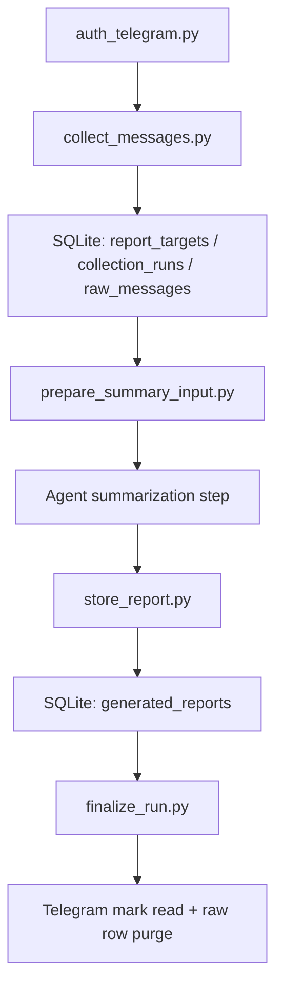

# Architecture

## Runtime Flow

## Component Boundaries

- `scripts/auth_telegram.py`: one-time interactive Telethon login bootstrap.
- `scripts/collect_messages.py`: resolves one target, fetches unread-first with a lookback fallback, stages normalized rows, and records run status.
- `scripts/prepare_summary_input.py`: builds an agent-friendly Markdown or JSON bundle from SQLite only.
- `scripts/store_report.py`: persists the agent-produced report to disk and to `generated_reports`.
- `scripts/finalize_run.py`: verifies a report exists, marks the target as read if requested, and purges raw rows by `run_id`.
- `scripts/purge_old_runs.py`: maintenance cleanup for old finalized runs.

## Storage Model

- `report_targets`: stable target aliases and resolved Telegram metadata.
- `collection_runs`: per-invocation lifecycle state, message counts, error summaries, and finalization timestamps.
- `raw_messages`: temporary normalized staging rows scoped by `run_id`.
- `generated_reports`: stored final Markdown reports for successful or in-progress finalization flows.

## Target Resolution Rules

Resolution order:

1. Existing `report_targets.target_key`
2. Numeric Telegram entity ID
3. Username with or without `@`
4. Fallback alias key

This makes alias mapping explicit while still allowing direct one-off target references.

## Concurrency Notes

- SQLite runs in WAL mode with a busy timeout.
- Every raw row and cleanup action is scoped by `run_id`.
- Shared Telethon session files can still be a concurrency bottleneck. Prefer one session file per worker or serialized Telegram access if multiple automations share an account.
