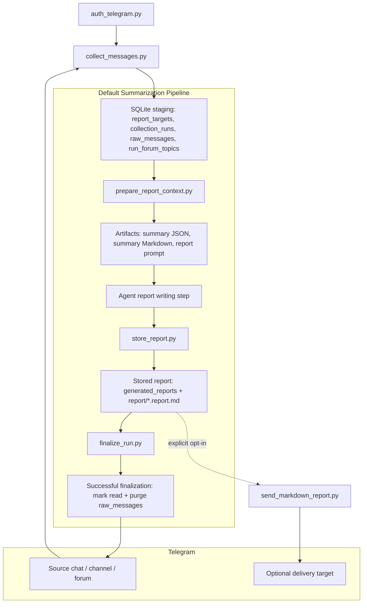

# Architecture

## Runtime Flow

## Component Boundaries

- `scripts/auth_telegram.py`: one-time interactive Telethon login bootstrap.
- `scripts/collect_messages.py`: resolves one target, fetches unread-first with a lookback fallback, stages normalized rows, records run status, and snapshots forum-topic metadata for forum runs.
- `scripts/prepare_report_context.py`: preferred orchestration step that writes both the summary bundle and report-writing brief under the dated report artifact tree.
- `scripts/prepare_summary_input.py`: builds an agent-friendly Markdown or JSON bundle from SQLite only.
- `scripts/build_report_prompt.py`: converts the prepared bundle into a generic report-writing brief for the agent.
- `scripts/store_report.py`: persists the agent-produced report to disk and to `generated_reports`, then updates the run with the stored report path.
- `scripts/finalize_run.py`: refuses to finalize until a stored report exists, then marks the source target as read if requested and purges raw rows by `run_id`.
- `scripts/purge_old_runs.py`: maintenance cleanup for old finalized runs.
- `scripts/send_markdown_report.py`: separate manual delivery path for an already-written report; it does not change collection-run state.

## Storage Model

- `report_targets`: stable target aliases and resolved Telegram metadata.
- `collection_runs`: per-invocation lifecycle state, message counts, error summaries, and finalization timestamps.
- `raw_messages`: temporary normalized staging rows scoped by `run_id`.
- `run_forum_topics`: per-run forum topic snapshot used to preserve topic-aware preparation and topic-scoped read acknowledgement.
- `generated_reports`: stored final Markdown reports for successful or in-progress finalization flows.
- `data/reports/DD.MM.YYYY/{summary,report_prompt,draft,report,final}`: on-disk artifact tree for one day's prepared bundles, prompts, drafts, canonical stored reports, and manually promoted finals.

## Target Resolution Rules

Resolution order:

1. Existing `report_targets.target_key`
2. Numeric Telegram entity ID
3. Username with or without `@`
4. Fallback alias key

This makes alias mapping explicit while still allowing direct one-off target references.

## Concurrency Notes

- SQLite runs in WAL mode with a busy timeout.
- Every raw row and cleanup action is scoped by `run_id`.
- Shared Telethon session files can still be a concurrency bottleneck. Prefer one session file per worker or serialized Telegram access if multiple automations share an account.
